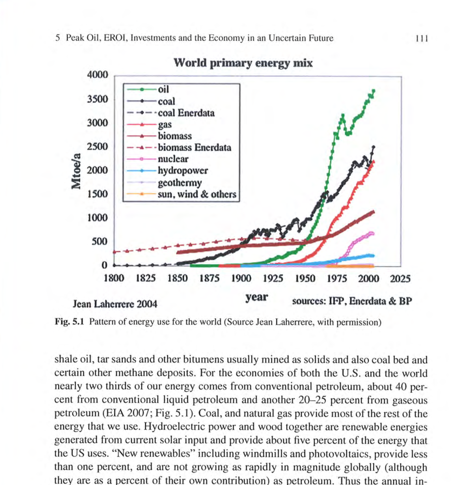
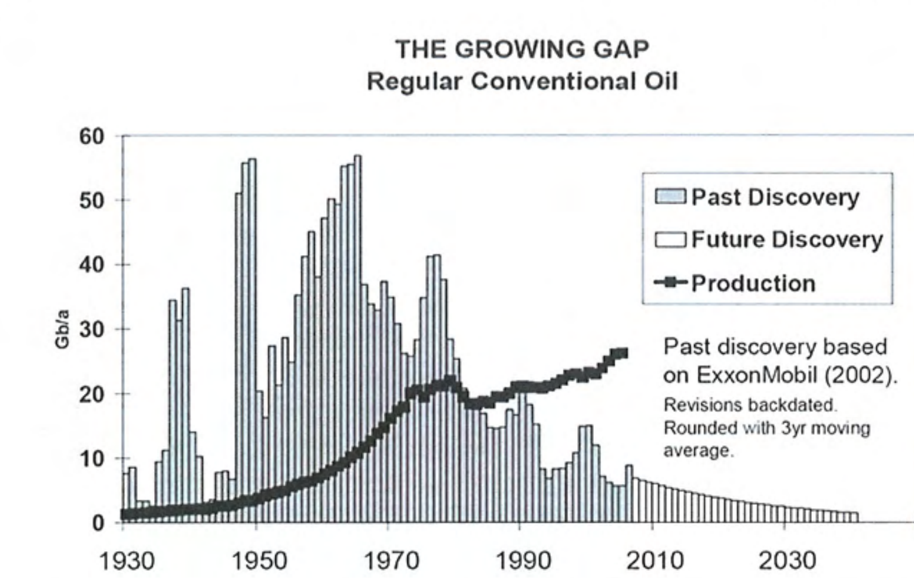
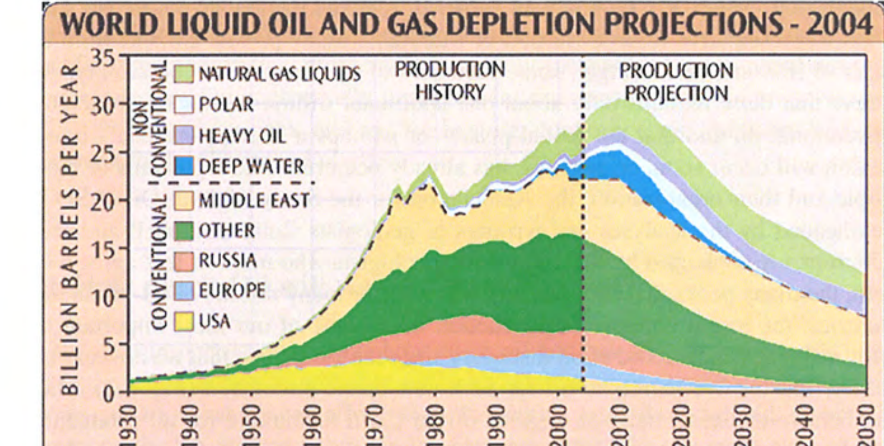
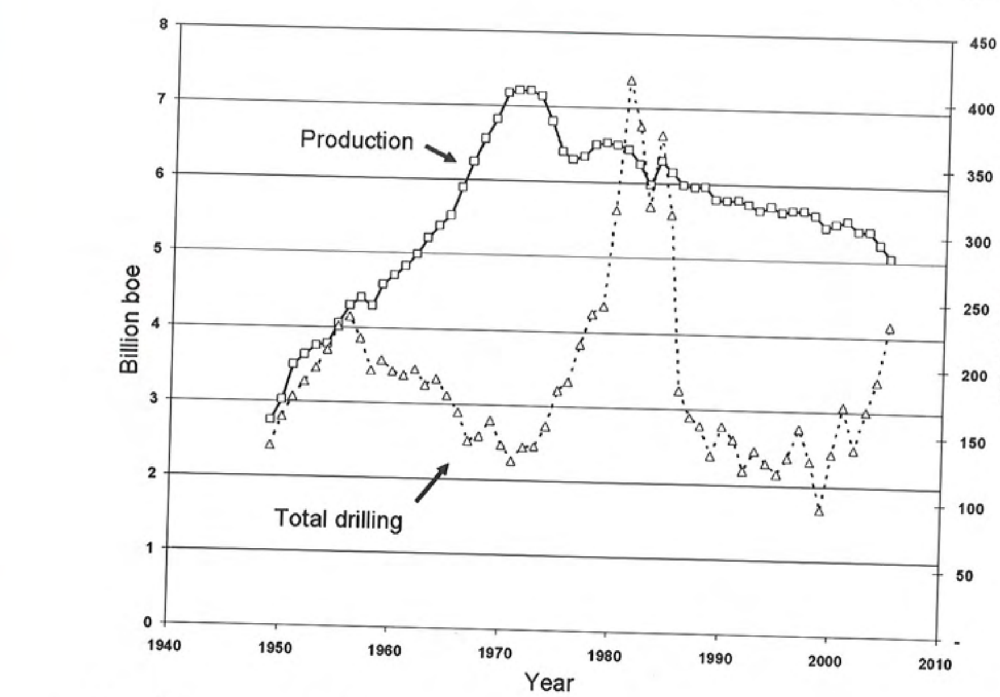
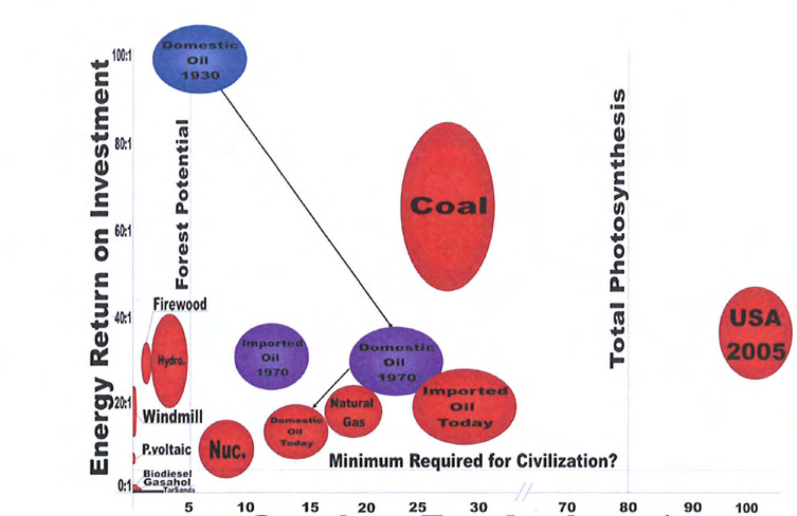
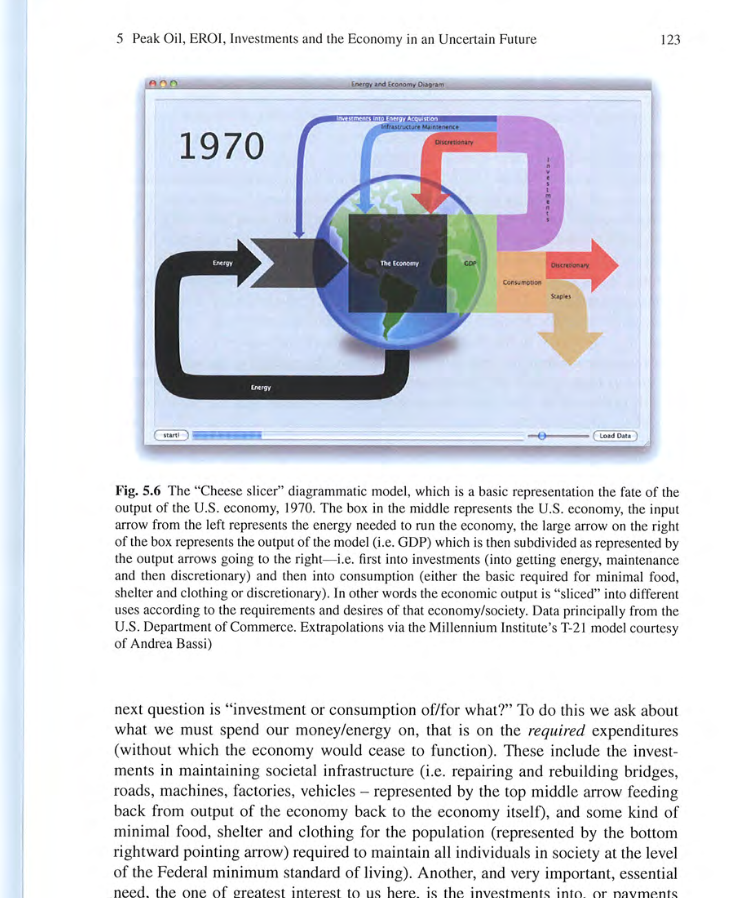
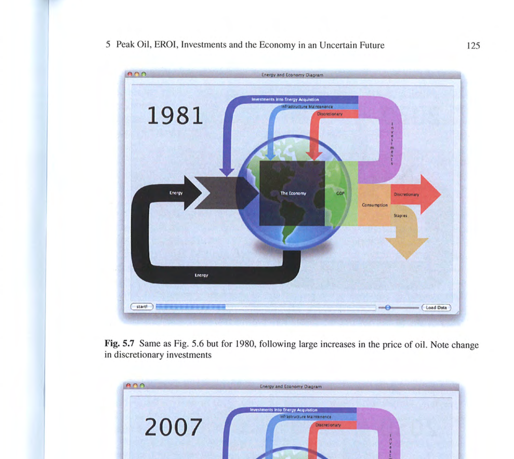
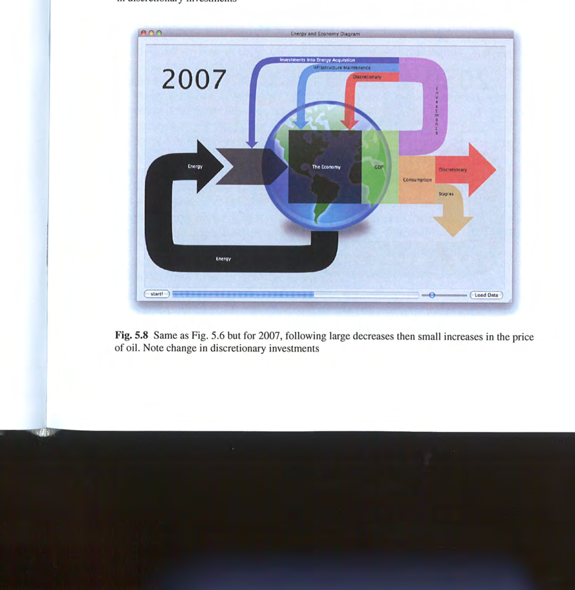
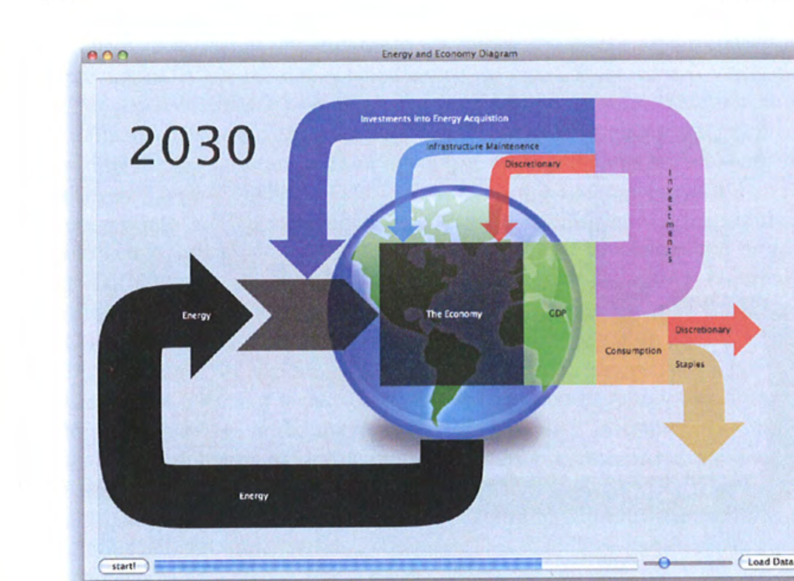
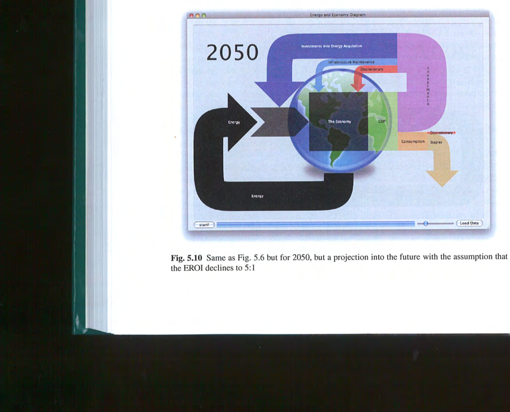

# Chapter 5

# Peak Oil, EROI, Investments and the Economy in an Uncertain Future

**Charles A. S. Hall, Robert Powers and William Schoenberg**

**Abstract** The issues surrounding energy are far more important, complex and pervasive than normally considered from the perspective of conventional economics, and they will be extremely resistant to market-based, or possibly any other, resolution. We live in an era completely dominated by readily available and cheap petroleum. This cheap petroleum is finite and currently there are no substitutes with the quality and quantity required. Of particular importance to society's past and future is that depletion is overtaking technology in many ways, so that the enormous wealth made possible by cheap petroleum is very unlikely to continue very far into the future. What this means principally is that investments will increasingly have to be made into simply getting the energy that today we take for granted, the net economic effect being the gradual squeezing out of discretionary investments and consumption. While there are certainly partial "supply-side" solutions to these issues, principally through a focus on certain types of solar power, the magnitude of the problem will be enormous because of the scale required, the declining net energy supplies available for investment and the relatively low net energy yields of the alternatives. Given that this issue is likely to be far more immediate, and perhaps more important, than even the serious issue of global warming it is remarkable how little attention we have paid to understanding it or its consequences.

**Keywords** Energy · oil · energy return on investment · investments · U.S. economy

---

C.A.S. Hall (correspondence)
State University of New York, College of Environmental Science and Forestry, Syracuse, New York 13210, e-mail: chall@esf.edu

R. Powers
State University of New York, College of Environmental Science and Forestry, Syracuse, New York 13210

W. Schoenberg
State University of New York, College of Environmental Science and Forestry, Syracuse, New York 13210

D. Pimentel (ed.), *Biofuels, Solar and Wind as Renewable Energy Systems*,
© Springer Science+Business Media B.V. 2008

---

## 5.1 Introduction

The enormous expansion of the human population and the economies of the United States and many other nations in the past 100 years have been accompanied by, and allowed by, a commensurate expansion in the use of fossil (old) fuels, meaning coal, oil and natural gas. To many energy analysts that expansion of cheap fuel energy has been the principal enabler of economic expansion, far more important than business acumen, economic policy or ideology although they too may be important (e.g. Soddy 1926, Tryon 1927, Cottrell 1955, Boulding 1966, Georgescu Roegan 1971, Odum 1971, Daly 1977, Herendeen and Bullard 1975, Hannon 1981, Kummel 1982, Kummel 1989, Jorgenson 1984 and 1988, Hall 1991, Hall et al. 1986 (and others), Cleveland 1991, Dung 1992, Ayers 1996, Cleveland and Ruth 1997, Hall 2000). While we are used to thinking about the economy in monetary terms, those of us trained in the natural sciences consider it equally valid to think about the economy and economics from the perspective of the energy required to make it run. When one spends a dollar, we do not think just about the dollar bill leaving our wallet and passing to some one else's. Rather, we think that to enable that transaction, that is to generate the good or service being purchased, an average of about 8,000 kilojoules of energy (equal to roughly the amount of oil that would fill a coffee cup) must be extracted from the Earth and turned into roughly a half kilogram of carbon dioxide (U.S. Statistical Review, various years). Take the money out of the economy and it could continue to function through barter, albeit in an extremely awkward, limited and inefficient way. Take the energy out and the economy would immediately contract immensely or stop. Cuba found this out in 1991 when the Soviet Union, facing its own oil production and political problems at that time, cut off Cuba's subsidized oil supply. Both Cuba's energy use and its GDP declined immediately by about one third, all groceries disappeared from market shelves within a week and the average Cuban lost 20 pounds (Quinn 2006). Cuba subsequently learned to live, in some ways well, on about half the oil as previously, but the impacts were enormous. While the United States has become more efficient in using energy in recent decades, most of this is due to using higher quality fuels, exporting heavy industry and switching what we call economic activity (e.g. Kaufmann 2004). Many other countries, including efficiency leader Japan, are becoming substantially less efficient (Hall and Ko, 2007, LeClere and Hall 2007, Smil 2007, personal communication).

## 5.2 The Age of Petroleum

The economy of the United States and the world is still based principally on "conventional" petroleum, meaning oil, gas and natural gas liquids (Fig. 5.1). *Conventional* means those fuels derived from geologic deposits, usually found and exploited using drill bit technology, and that move to the surface because of their own pressure or with pumping or additional pressure supplied by injecting natural gas, water or occasionally other substances into the reservoir. *Unconventional* petroleum includes shale oil, tar sands and other bitumens usually mined as solids and also coal bed and certain other methane deposits. For the economies of both the U.S. and the world nearly two thirds of our energy comes from conventional petroleum, about 40 percent from conventional liquid petroleum and another 20-25 percent from gaseous petroleum (EIA 2007; Fig. 5.1). Coal, and natural gas provide most of the rest of the energy that we use. Hydroelectric power and wood together are renewable energies generated from current solar input and provide about five percent of the energy that the US uses. "New renewables" including windmills and photovoltaics, provide less than one percent, and are not growing as rapidly in magnitude globally (although they are as a percent of their own contribution) as petroleum. Thus the annual increase in oil and gas use is much greater than the new quantities coming from the new renewables, at least to date. All of these proportions have not changed very much since the 1970s in the United States or the world. We believe it most accurate to consider the times that we live in as the age of petroleum, for petroleum is the foundation of our economies and our lives. Just look around.

**Fig. 5.1** Pattern of energy use for the world (Source Jean Laherrere, with permission)

Petroleum is especially important because of its magnitude of current use, because it has important and unique qualitative attributes leading to high economic utility that include very high energy density and transportability (Cleveland 2005), and because its future supply is worrisome. The issue is not the point at which oil actually runs out but rather the relation between supply and potential demand. Barring a massive worldwide recession demand will continue to increase as human populations, petroleum-based agriculture and economies (especially Asian) continue to grow. Petroleum supplies have been growing most years since 1900 at two or three percent per year, a trend that most investigators think cannot continue (e.g. Campbell and Laherrere 1998, Heinberg 2003). Peak oil, that is the time at which an oil field, a nation or the entire world reaches its maximum oil production and then declines, is not some abstract issue debated by theoretical scientists or worried citizens but an actuality that occurred in the United States in 1970 and in some 60 (of 80) other oil-producing nations since (Hubbert 1974, Strahan 2007, Energyfiles 2007). Several prominent geologists have suggested that it may have occurred already for the world, although that is not clear yet (e.g. Deffeyes 2005, see EIA 2007, IEA 2007). With global demand showing no sign of abating at some time it will not be possible to continue to increase petroleum supplies, especially oil globally and natural gas in North America, or even to maintain current levels of supply, regardless of technology or price. At this point we will enter the second half of the age of oil (Campbell 2005). The first half was one of year by year growth, the second half will be of continued importance but year by year decline in supply, with possibly an "undulating plateau" at the top and some help from still-abundant natural gas outside North America separating the two halves and buffering the impact somewhat for a decade or so. We are of the opinion that it will not be possible to fill in the growing gap between supply and demand of conventional oil with e.g. liquid biomass alternatives on the scale required (Hall et al. in review), and even were that possible that the investments and time required to do so would mean that we needed to get started some decades ago (Hirsch et al. 2005). When the decline in global oil production begins we will see the "end of cheap oil" and a very different economic climate.

The very large use of fossil fuels in the United States means that each of us has the equivalent of 60-80 hard working laborers to "hew our wood and haul our water" as well as to grow, transport and cook our food, make, transport and import our consumer goods, provide sophisticated medical and health services, visit our relatives and take vacations in far away or even relatively near by places. Simply to grow our food requires the energy of about a gallon of oil per person per day, and if a North American takes a hot shower in the morning he or she will have already used far more energy than probably two thirds of the Earth's human population use in an entire day. Oil is especially important for the transportation of ourselves and of our goods and services, and gas for heating, cooking, some industries and as a feedstock for fertilizers and plastics.

## 5.3 How much Oil will we be able to Extract?

So the next important question is how much oil and gas are left in the world? The answer is a lot, although probably not a lot relative to our increasing needs, and maybe not a lot that we can afford to exploit with a large financial and, especially, energy profit. We will probably always have enough oil to oil our bicycle chains. The question is whether we will have anything like the quantity that we use now at the prices that allow the things we are used to having. Usually the issue of how much oil remains is not developed from the perspective of "when will we run out" but rather "when will we reach 'peak oil' globally". World wide we have consumed a little over one trillion barrels of oil. The current debate is fundamentally about whether there are 1, 2 or even 3.5 trillion barrels of economically extractable oil left to consume. Fundamental to this debate, yet mostly ignored, is an understanding of the capital, operating and environmental costs, in terms of money and energy, to find, extract and use whatever new sources of oil remain to be discovered, and to generate whatever alternatives we might choose to develop. Thus the investment issues, in terms of both money and energy, will become ever more important.

There are two distinct camps for this issue. One camp, which we call the "technological cornucopians", led principally by economists such as Michael Lynch (e.g. Lynch 1996, Adelman and Lynch 1997), believes that market forces and technology will continue to supply (at a price) more or less whatever oil we need for the indefinite future. They focus on the fact that we now are able to extract only some 35 percent of the oil from an oil field, that large areas of the world (deep ocean, Greenland, Antarctica) have not been explored and may have substantial supplies of oil, and that substitutes, such as oil shale and tar sands, abound. They are buoyed by the failure of many earlier predictions of the demise or peak of oil, two recent and prestigious analyses by the U.S. Geological Survey and the Cambridge Energy Research Associates that tend to suggest that remaining extractable oil is near the high end given above, the recent discovery of the deepwater Jack 2 well in the Gulf of Mexico and the development of the Alberta Tar Sands, which are said to contain more oil than remains even in Saudi Arabia. They have a strong faith in technology to increase massively the proportion of oil that can be extracted from a given oil field, believe that many additional fields await additional exploration, and believe there are good substitutes for oil.

A second camp, which we can call the "peak oilers", is composed principally of scientists from a diversity of fields inspired by the pioneering work of M. King Hubbert (e.g. 1969; 1974), a few very knowledgeable and articulate politicians such as US Representative Roscoe Bartlett of Maryland, many private citizens from all walks of life and, increasingly, some members of the investment community. All believe that there remains only about one additional trillion barrels of extractable conventional oil and that the global peak -- or perhaps a "bumpy plateau", in extraction will occur soon, or, perhaps, has already occurred. The arguments of these people and their organization, the Association for the Study of Peak Oil (ASPO), spearheaded by the analyses and writings of geologists Colin Campbell and Jean Laherrere, are supported by the many other geologists who more or less agree with them, the many peaks that have already occurred for many dozens of oil-producing countries, the recent collapse of production from some of our most important oil fields and the dismal record of oil discovery since the 1960s -- so that we now extract and use four or five barrels of oil for each new barrel discovered (Fig. 5.2). They also believe that essentially all regions of the Earth favourable for oil production have been well explored for oil, so that there are few surprises left except perhaps in regions that will be nearly impossible to exploit.

**Fig. 5.2** Rate of the finding of oil (where revisions and extensions have been added into the year of initial strike) and of consumption (Source ASPO website)

There are several issues that tend to muddy the water around the issue of peak oil. First of all, some people do, and some do not, include natural gas liquids or condensate (liquid hydrocarbons that condense out of natural gas when it is held in surface tanks). These can be refined readily into motor fuel and other uses so that many investigators think they should simply be lumped with oil, which most usually they are. Since a peak in global natural gas production is thought to be one or two decades after a peak in global oil, inclusion of natural gas liquids extends the time or duration of whatever oil peak may occur (Fig. 5.3). Consequently, if indeed peak oil has occurred, a peak in liquid petroleum fuels might still be before us. A second

**Fig. 5.3** Conventional oil use data and projections with the inclusion of non-conventional liquid fuels (Source ASPO website)

main issue is "how much oil is likely ever to be produced" vs. "when will global production peak, or at least cease growing?" In theory the issues are linked, perhaps tightly, but it is probably far more important to focus on the peak production rate rather than the total quantity that we will ever extract. In terms of ultimate economic impact, and probably prices, the most important issue is almost certainly the ratio between the production rate and its increase or decrease, and the consumption rate and its increase or decrease. Both the production and the consumption of oil and also natural gas have been growing at roughly two percent a year up through at least 2006. The great expansion of the economies of China and India, which at this time show no evidence of a slowdown, have recently more than compensated for some reduced use in other parts of the world. Nevertheless the growth rate of the human population has been even greater so that "per capita peak oil" probably occurred in 1978 (Duncan 2000). What the future holds may have more to do with the consumption rate than the production rate. If and when peak petroleum extraction occurs it is likely to increase prices which should bring an economic slowdown which should decrease oil use which might decrease prices and ... the chickens and eggs can keep going for some time. That is why many peak oilers speak of "a bumpy plateau". However if potential demand keeps growing then the difference between a steady or declining supply and an increasing demand presumably would continue upward pressures on prices.

The rates of oil and gas production (more accurately extraction) and the onset of peak oil are dependent upon many interacting factors, including geological, economic and political. The geological restrictions are the most absolute and depend on the number and physical capacity of the world's operating wells. In most fields the oil does not exist in the familiar liquid state but in what is more akin to a complex oil-soaked brick. The rate at which oil can flow through these "aquifers" depends principally upon the physical properties of the oil itself and of the geological substrate, but also upon the pressure behind the oil that is provided initially by the gas in the well. Then, as the field matures, the pressure necessary to force the oil through the substrate to the collecting wells is supplied increasingly by pumping more gas or water into the structure. As with water wells the more rapidly the oil is extracted the more likely the substrate will become compacted, restricting future yields. Detergents, CO2 and steam can increase yields but too-rapid extraction can cause compaction of the "aquifer" or fragmentation of flows which reduce yields. So our physical capacity to produce oil depends upon our ability to keep finding large oil fields in regions that we can reasonably access, our willingness to invest in exploration and development, and our willingness to not produce too quickly. The usual economic argument is that if supply is reduced relative to demand then the price will increase which will then signal oil companies to drill more, leading to the discovery of more oil and then additional supply. Although that sounds logical the results from the oil industry might not be in accordance to that logic as the empirical record shows that the rate at which oil and gas is found has little to do with the rate of drilling (Fig. 5.4).

It is thought that at this time we are producing oil globally pretty nearly to our present capacity, although future depletion or new fields can change that. Finally,

**Fig. 5.4** Annual rates of total drilling for and production of oil and gas in the US, 1949-2005 (R^2 of the two = 0.005; source: U.S. EIA and N. D. Gagnon). Since drilling and other exploration activities are energy intensive, other things being equal EROI is lower when drilling rates are high

output can be limited or (at least in the past) enhanced for political reasons -- which are even more difficult to predict than the geological restrictions. Empirically there is a fair amount of evidence from post peak countries, such as the U.S., that the physical limitations become important when about half of the ultimately-recoverable oil has been extracted. But why should that be? In the US it certainly was not due to a lack of investment, since most geologists believe that the US had been over drilled. We probably will not know until we have much more data, and much of the data are closely guarded industry or state secrets. According to one analyst if one looks at all of the 60 or so post peak oil-producing countries the peak occurs on average when about 54 percent of the total extractable oil in place has been extracted (Energyfiles.com 2007). Finally oil-producing nations often have high population and economic growth, and are using an increasing proportion of their own production (Hallock et al. 2004).

The United States clearly has experienced "peak oil". In a way this is quite remarkable, because as the price of oil increased by a factor of ten, from 3.50 to 35 dollars a barrel during the 1970s, a huge amount of capital was invested in US oil discovery and production efforts so that the drilling rate increase from 120 million feet per year in 1970 to 400 million feet in 1985. Nevertheless the production of crude oil decreased during the same period from the peak of 3.52 billion barrels a year in 1970 to 3.27 in 1985 and has continued to decline to 1.89 in 2005 even with the addition of Alaskan production. Natural gas production has also peaked and declined, although less regularly (This is included in Fig. 5.4). Thus despite advancement of petroleum discovery and production technology, and despite very significant investment, U.S. production has continued its downward trend since 1970. The technological optimists are correct in saying that advancing technology is important. But there are two fundamental and contradictory forces operating here, technological advances and depletion. In the US oil industry it is clear that depletion is trumping technological progress, as oil production is declining and oil is becoming much more expensive to produce.

## 5.4 Decreasing Energy Return on Investment

Energy return on investment (EROI or EROEI) is simply the energy that one obtains from an activity compared to the energy it took to generate that energy. The procedures are generally straightforward, although rather too dependent upon assumptions made as to the boundaries, and when the numerator and denominator are derived in the same units, as they should, it does not matter if the units are barrels (of oil) per barrel, Kcals per Kcal or MJoules per Mjoule as the results are in a unitless ratio. The running average EROI for the finding and production of US domestic oil has dropped from greater than 100 kilojoule returned per kilojoule invested in the 1930s to about thirty to one in the 1970s to between 11 and 18 to one today. This is a consequence of the decreasing energy returns as oil reservoirs are increasingly depleted and as there are increases in the energy costs as exploration and development are shifted increasingly deeper and offshore (Cleveland et al. 1984, Hall et al. 1986, Cleveland 2005). Even that ratio reflects mostly pumping out oil fields that are half a century or more old since we are finding few significant new fields. (In other words we can say that new oil is becoming increasingly more costly, in terms of dollars and energy, to find and extract). The increasing energy cost of a marginal barrel of oil or gas is one of the factors behind their increasing dollar cost, although if one corrects for general inflation the price of oil has increased only a moderate amount until 2007.

The same pattern of declining energy return on energy investment appears to be true for global petroleum production. Getting such information is very difficult, but with help from the superb database of the John H. Herold Company, several of their personnel, and graduate student and sometime Herold employee Nate Gagnon we were able to generate an approximate value for global EROI for finding new oil and natural gas (considered together). Our preliminary results indicate that the EROI for global oil and gas (at least for that which was publically traded) was roughly 26:1 in 1992, increased to about 35:1 in 1999, and since has fallen to approximately 19:1 in 2005. The apparent increase in EROI during the late 1990s is during a period when drilling effort was relatively low and may reflect the effects of reduced drilling effort as was seen for oil and gas in the United States (e.g. Fig. 5.4). If the rate of decline continues linearly for several decades then it would take the energy in a barrel of oil to get a new barrel of oil. While we do not know whether that extrapolation is accurate, essentially all EROI studies of our principal fossil fuels do indicate that their EROI is declining over time, and that EROI declines especially rapidly with increased exploitation (e.g. drilling) rates. This decline appears to be reflected in economic results. In November of 2004 The New York Times reported that for the previous three years oil exploration companies worldwide had spent more money in exploration than they had recovered in the dollar value of reserves found. Thus even though the EROI of global oil and gas is still about 18:1 as of 2006, this ratio is for all exploration and production activities. It is possible that the energy break even point has been approached or even reached for finding new oil. Whether we have reached this point or not the concept of EROI declining toward 1:1 makes irrelevant the reports of several oil analysts who believe that we may have substantially more oil left in the world, because it does not make sense to extract oil, at least for a fuel, when it requires more energy for the extraction than is found in the oil extracted.

How well we weather this coming storm will depend in large part on how we manage our investments now. From the perspective of energy there are three general types of investments that we make in society. The first is investments into getting energy itself, the second is investments for maintenance of, and replacing, existing infrastructure, and the third is discretionary expansion. In other words before we can think about expanding the economy we must first make the investments into getting the energy necessary to operate the existing economy, and into maintaining the infrastructure that we have, at least unless we wish to accept the entropy-driven degradation of what we already have. Investors must accept the fact that the required investments into the second and especially the first category are likely to increasingly limit what is available for the third. In other words the dollar and energy investments needed to get the energy needed to allow the rest of the economy to operate and grow have been very small historically, but this is likely to change dramatically. This is true whether we seek to continue our reliance on ever-scarcer petroleum or whether we attempt to develop some alternative. Technological improvements, if indeed they are possible, are extremely unlikely to bring back the low investments in energy that we have grown accustomed to.

The main problem that we face is a consequence of the "best first" principle. This is, quite simply, the characteristic of humans to use the highest quality resources first, be they timber, fish, soil, copper ore or, of relevance here, fossil fuels. This is because economic incentives are to exploit the highest quality, least cost (both in terms of energy and dollars) resources first, as was noted 200 years ago by economist David Ricardo (e.g. 1891). We have been exploiting fossil fuels for a long time. The peak in finding oil was in the 1930s for the United States and in the 1960s for the world, and both have declined enormously since then. An even greater decline has taken place in the efficiency with which we find oil, that is the amount of energy that we find relative to the energy we invest in seeking and exploiting it. As a consequence of the decreasing energy returns as oil depletion increases, and of the increasing energy costs as exploration and development shifted increasingly deeper offshore or into increasingly hostile environments, the energy return on investment (EROI) for US domestic oil has declined to perhaps 15 to one today, even though that contemporary ratio reflects mostly pumping out oil fields that are half a century or older. In other words we can say that new oil is becoming increasingly more costly, in terms of energy (and consequently dollars), to find and extract. The alternatives to oil available to us today are characterized by even lower EROIs, limiting their economic effectiveness. It is critical for CEOs and government officials to understand that the best oil and gas are simply gone, and there is no easy replacement.

That pattern of exploiting and depleting the best resources first also is occurring for natural gas. Natural gas was once considered a dangerous waste product of oil development and was burned or flared at the well head. But during the middle years of the last century large gas pipeline systems were developed in the U.S. and Europe that enabled gas to be sent to myriad users who increasingly discovered its qualities of ease of use and cleanliness, including its relatively low carbon dioxide emissions, at least relative to coal. US natural gas originally came from large fields in Louisiana, Texas and Oklahoma. Its production has moved increasingly to smaller fields distributed throughout Appalachia and, increasingly, the Rockies. As the largest fields that traditionally supplied the country peaked and declined a national peak in production occurred in 1973, and then as "unconventional" fields were developed a second, somewhat smaller peak occurred in 2001. Gas production has fallen by about 6 percent from that peak, and many investigators predict a "natural gas cliff" as traditional fields are exhausted and as it is increasingly difficult to bring smaller unconventional fields on line to replace the depleted giants. There had been an encouragement of electricity production from natural gas because it is relatively clean, but a large loss of petrochemical companies from the US because of the increasing price.

## 5.5 The Balloon Graph

We pay for imported oil in energy as well as dollars, for it takes energy to grow, manufacture or harvest what we sell abroad to gain the foreign exchange with which we buy fuel, (or we must in the future if we pay with debt today). In 1970 we gained roughly 30 megajoules for each megajoule used to make the crops, jet airplanes and so on that we exported (Hall et al. 1986). But as the price of imported oil increased, the EROI of the imported oil declined. By 1974 that ratio had dropped to nine to one, and by 1980 to three to one. The subsequent decline in the price of oil, aided by the inflation of the export products traded, eventually returned the energy terms of trade to something like it was in 1970, at least until the price of oil started to increase again after 2000. A rough estimate of the quantity and EROI of various major fuels in the U.S., including possible alternatives, is given in Fig. 5.5. An obvious aspect of that graph is that qualitatively and quantitatively alternatives to fossil fuel have a very long way to go to fill the shoes of fossil fuels. This is especially true when one considers the additional qualities of oil and gas, including energy density, ease of transport and ease of use.

The implications of all this is that if we are to supply into the future the amount of petroleum that the US consumed in the first half of this decade it will require

**Fig. 5.5** "Balloon graph" representing quality (y graph) and quantity (x graph) of the United States economy for various fuels at various times. Arrows connect fuels from various times (i.e. domestic oil in 1930, 1970, 2005), and the size of the "balloon" represents part of the uncertainty associated with EROI estimates (Source: US EIA, Cutler Cleveland and C. Hall's own EROI work in preparation)

Source: US EIA, Cleveland et al. 1984, Cleveland 2005, Hall various including 1986 and http://www.theoildrum.com/node/3786.

enormous investments in either additional unconventional sources, in import facilities or as payments to foreign suppliers. That will mean a diversion of investment capital and of money more generally from other uses into getting the same amount of energy just to run the existing economy. In other words investments, from a national perspective, will be needed increasingly just to run what we have, not to generate real new growth. If we do not make these investments our energy supplies will falter or we will be tremendously beholden to foreigners, and if we do the returns may be small to the nation, although of course if the price of energy increases greatly the returns to the individual investor may be large. Another implication is if this issue is as important as we believe it is then we must pay much more attention to the quality of the data we are getting about energy costs of all things we do, including getting energy. Finally the failure of increased drilling to return more fuel (Fig. 5.4) calls into question the basic economic assumption that scarcity-generated higher prices will resolve that scarcity by encouraging more production. Indeed scarcity encourages more exploration and development activity, but that activity does not necessarily generate more resources. It will also encourage the development of alternative liquid fuels, but their EROIs are generally very low (Fig. 5.5).

## 5.6 Economic Impacts of Peak Oil and Decreasing EROI

Whether global peak oil has occurred already or will not occur for some years or, conceivably, decades, its economic implications will be enormous because we have no possible substitute on the scale required and because alternatives will require enormous investments in money and energy when both are likely to be in short supply. Despite the projected impact on our economic and business life within relatively few years or at most decades, neither government nor the business community is in any way prepared to deal with either the impacts of these changes or the new thinking needed for investment strategies. The reasons are myriad but include: the disinterest of the media, the failure of government to fund good analytic work on the various energy options, the erosion of good energy record keeping at the department of commerce, and the lack of really good options. The second point perhaps is debatable but we stand on that statement because of the top ten or so energy analysts that we are familiar with none are supported by government, or generally any, funding. There are not even targeted programs in NSF or the Department of Energy where one might apply if one wishes to undertake good objective, peer reviewed EROI analyses. Consequently much of what is written about energy is woefully misinformed or simply advocacy by various groups that hope to profit from various perceived alternatives. It is not unlikely that issues pertaining to the end of cheap petroleum will be the most important challenge that Western society has ever faced, especially when considered within the context of our need to deal with climate change and other environmental issues related to energy. Any business leaders who do not understand the inevitability, seriousness and implications of the end of cheap oil, or who make poor decisions in an attempt to alleviate its impact, are likely to be tremendously and negatively impacted as a result. At the same time the investment decisions we will make in the next decades will determine whether civilization is to make it through the transition away from petroleum or not.

What would be the impacts of a large increase in the energy and dollar cost of getting our petroleum, or of any restriction in its availability? While it is extremely difficult to make any hard predictions, we do have the record of the impacts of the large oil price increases of the 1970s as a possible guide. These "oil shocks" had very serious impacts on our economy which we have examined empirically in past publications (e.g. Hall et al. 1986). Many economists then and now did not think that even large increases in the price of energy would affect the economy dramatically because energy costs were but three to six percent of GDP. But by 1980, following the two "oil price shocks" of the 1970s, energy costs had increased dramatically until they were 14 percent of GDP. Actual shortages would have even greater impacts, if for example sufficient petroleum to run our industries or businesses were not available at any price. Other impacts included, and would include, an enhancement of our trade imbalances as more income is diverted overseas, adding to the foreign holdings of our debt and a decrease in discretionary disposable income as more money is diverted to access energy, whether via higher prices, more petroleum exploration or low EROI alternative fuels. This in turn would affect those sectors of the economy that are not essential. Consumer discretionary spending would probably fall dramatically, greatly effecting non-essential businesses such as tourism.

## 5.7 The "Cheese Slicer" Model

We have attempted to put together a conceptual and computer model to help us understand what might be the most basic implications of changing EROI on the economic activity of the United States. The model was conceptualized when we examined how the U.S. economy responded to the "oil shocks" of the 1970s. The underlying foundation is the reality that the economy as a whole requires energy (and other natural resources derived from nature) to run, and without these most basic components it will cease to function. The other premise of this model is that the economy as a whole is faced with choices in how to allocate its output in order to maintain itself and to do other things. Essentially the economy (and the collective decision makers in that economy) has opportunity costs associated with each decision it makes. Figure 5.6 shows our basic conceptual model parameterized for 1970, before the oil shocks of that decade. The large square represents the structure of the economy as a whole, which we put inside a symbol of the Earth biosphere/geosphere to reflect the fact that the economy must operate within the biosphere (e.g. Hall et al. 2001). In addition, of course, the economy must get energy and raw materials from *outside* the economy, at least as narrowly perceived, that is from nature (i.e. the biosphere/geosphere). The output of the economy, normally considered GDP, is represented by the large arrow coming out of the right side, where the depth of the arrow represents 100 percent of GDP. For the sake of developing our concept we think of the economy, for the moment, as an enormous dairy industry and cheese as the product coming out of the right hand side, moving towards the right. This output (i.e. the entire arrow) could be represented as either money or embodied energy. We use the former in this analysis (as almost all of the relevant data is recorded in monetary, not energy, units), but it is probably not terribly different from using energy outputs. So, our most important question is "how do we slice the cheese", that is how do we, and how will we divide up the output of the economy, or said differently, in what way can the output of the economy be divided up with the least objectionable opportunity cost. Most economists might answer "according to what the market decides," that is according to consumer tastes and buying habits. But we want to think about it a little differently because we think things might be profoundly different in the future.

Most generally the output of the model (and the economy) has two destinations: *investment* or *consumption*. These could be divided further into private vs. government investments and consumptions, or we could add in debt service, exports and imports, and so on. We choose not to do this, at least initially, although we are co-developing a much more complicated model of the economy with the Millennium Institute called T-21 North America. (e.g. Millennium Institute 2007). Our

**Fig. 5.6** The "Cheese slicer" diagrammatic model, which is a basic representation the fate of the output of the U.S. economy, 1970. The box in the middle represents the U.S. economy, the input arrow from the left represents the energy needed to run the economy, the large arrow on the right of the box represents the output of the model (i.e. GDP) which is then subdivided as represented by the output arrows going to the right--i.e. first into investments (into getting energy, maintenance and then discretionary) and then into consumption (either the basic required for minimal food, shelter and clothing or discretionary). In other words the economic output is "sliced" into different uses according to the requirements and desires of that economy/society. Data principally from the U.S. Department of Commerce. Extrapolations via the Millennium Institute's T-21 model courtesy of Andrea Bassi)

next question is "investment or consumption of/for what?" To do this we ask about what we must spend our money/energy on, that is on the *required* expenditures (without which the economy would cease to function). These include the investments in maintaining societal infrastructure (i.e. repairing and rebuilding bridges, roads, machines, factories, vehicles -- represented by the top middle arrow feeding back from output of the economy back to the economy itself), and some kind of minimal food, shelter and clothing for the population (represented by the bottom rightward pointing arrow) required to maintain all individuals in society at the level of the Federal minimum standard of living). Another, and very important, essential need, the one of greatest interest to us here, is the investments into, or payments for, energy (i.e. the amount of diverted economic output that is used to secure and purchase our imported oil) that is required for the energy needed for the economy to operate at any particular level. This energy is absolutely critical for the economy to operate and must be paid for through proper payments and investments -- which we consider together as investments to get energy. No investment in energy, no economic output. While there may be other critical inputs from nature (water, minerals etc.) or society (educated workforce etc.) we ignore these for the moment as they are unlikely to be as volatile as energy. This "Energy Investment" feedback is represented by the top-most arrow from the output of the economy back upstream to the "workgate" symbol (Odum 1971). The width of this line represents the investment of energy into getting more energy. Of critical interest here is that as the EROI of our economy's total combined fuel source declines then more and more of the output of the economy *must* be shunted back to getting the energy required to run the economy if the economy is to remain the same size.

Once these necessities are taken care of then what is left is considered the *discretionary* output of the economy. This can be either discretionary consumption (a vacation or a fancier meal, car or house than needed, represented by the upper right pointing arrow in the diagrams) or discretionary investment (i.e. building a new tourist destination in Florida or the Caribbean, represented as the lowest of the top arrows feeding back into the economy. During the last 100 years the enormous wealth generated by the United States economy has meant that we have had an enormous amount of discretionary income. This is in large part because the energy investments represented in Fig. 5.6 have been relatively small.

It turns out that the needed information to construct the above division of the economy is reasonably easy to come by for the U.S. economy, at least if we are willing to make a few major assumptions and accept a fairly large margin of error. Inflation-corrected GDP, i.e. the size of the output of the economy, is published routinely by the U.S. Department of Commerce. The total investments for maintenance in the U.S. economy are available as "Deprecation of Fixed Capital", U.S. Department of Commerce, various years). The minimum needed for food, shelter and clothing is available as "Personal Consumption Expenditures" (or the minimum of that required to be above poverty) which we selected from the U.S. Department of Commerce for various years). The investment into energy acquisition is the sum of all of the capital costs in all of the energy producing sectors of the U.S. plus expenditures for purchased foreign fuel. Empirical values for these components of the economy are plotted in Figs. 5.6-5.10. When these three requirements for maintaining the economy: investments and payments for energy, maintenance of infrastructure and maintenance of people are subtracted from the total GDP then what is left is discretionary income.

We simulated two basic data streams: the U.S. economy from 1949 to 2005 (representing the growth prior to the "oil crises" of 1973 and 1979, the impact of the oil crisis and the recovery from that, which had occurred by the mid-1990s. Then we projected this data stream into the future by extrapolating the data used prior to 2005 along with the assumption that the EROI for society declined from an average of roughly 20:1 in 2005 to 5:1 in 2040. This is an arbitrary scenario but may represent what we have in store for us as we enter the "second half of the age of oil", i.e. a time of declining availability and rising price so that more and more of society's output needs to be diverted into the top arrow of e.g. Fig. 5.6.

**Fig. 5.7** Same as Fig. 5.6 but for 1980, following large increases in the price of oil. Note change in discretionary investments

**Fig. 5.8** Same as Fig. 5.6 but for 2007, following large decreases then small increases in the price of oil. Note change in discretionary investments

**Fig. 5.9** Same as Fig. 5.6 but for 2030, with a projection into the future with the assumption that the EROI declines from 20:1 (on average) to 10:1

**Fig. 5.10** Same as Fig. 5.6 but for 2050, but a projection into the future with the assumption that the EROI declines to 5:1

## 5.8 Results of Simulation

The results of our simulation suggest that discretionary income, including both discretionary investments and discretionary consumption, will move from the present 50 or so percent in 2005 to about 10 percent by 2050, or whenever (or if) the composite EROI of all of our fuels reaches about 5:1 (Figs. 5.9-5.10).

## 5.9 Discussion

Individual businesses would be affected by having their fuel costs increase and, for many, a reduction in demand for their products. This simultaneous inflation and recession happened in the 1970s and is projected to happen into the future as EROI for primary fuels declines. The "stagflation" that occurred in the 1970s was not supposed to happen according to an economic theory called the Phillips curve. But an energy-based explanation is easy (e.g. Hall 1992). As more money was diverted to getting the energy necessary to run the rest of the economy disposable income, and hence demand for many non-essential goods and services, declined, leading to economic stagnation. Meanwhile the increased cost for energy led to inflation, as there was no additional production that occurred from this greater expenditure. Although unemployment increased overall during the 1970s it was not as much as demand decreased, as labor at the margin became relatively useful compared to increasingly-expensive energy. Individual sectors might be much more impacted as happened in 2005, for example, with many Louisiana petrochemical companies that were forced to close or move overseas when the price of natural gas increased. On the other hand alternate energy businesses, from forestry operations and woodcutting to solar devices, might do very well.

When the price of oil increases it does not seem to be in the national or in corporate interest to invest in more energy-intensive consumption, as Ford Motor Company seems to be finding out with its large emphasis on large SUVs and pickup trucks. We are likely to have over invested already in the number of remote second homes, cruise ships, and Caribbean semi-luxury hotels, so that it may not a particularly good idea to do more of that now. This is due to the "Cancun effect" -- that such hotels require the existence of large amounts of disposable income from the US middle class and cheap energy. That disposable income may have to be shifted into the energy sector with less of an opportunity cost to the economy as a whole. Investors who understand the changing rules of the investment game are likely to do much better in the long run.

So what can the scientist say to the investor? The options are not easy. As noted above worldwide investments in seeking oil have had very low monetary returns in recent years. Investments in many alternatives may not fare much better. Ethanol from corn projects were once financially profitable to the individual investor because they have been highly subsidized by the government, but they are probably a poor investment for the Nation. It is not clear that this fuel makes much of an energy profit, with an EROI of 1.6 at best, and less than one for one at worst, depending upon the study used for analysis (see review in Farrell et al. 2006 and also the many letters on that article in Science Magazine, June 23, 2006). Biodiesel may have an EROI of about three to one. Is that a good investment? Clearly not relative to remaining petroleum, but some day as petroleum EROI declines it may be. However real fuels must have EROIs of 5 or 10 or more returned on one invested to not be subsidized by petroleum or coal in many ways, such as the construction of the vehicles and roads that use them. Other biomass, such as wood, can have good EROIs when used as solid fuel but face real difficulties when converted to liquid fuels, and the technology is barely developed. The scale of the problem can be seen by the fact that we presently use more fossil energy in the US than is fixed by all green plant production, including all of our croplands and all of our forests (Pimentel, D. Personal communication). Biomass fuels may make more sense in nations where biomass is very plentiful and, more importantly, where present use of petroleum is much less than in the US. Alternatively one might argue that if we could bring the use of liquid fuels in the United States down to, say, 20 percent of the present then liquid fuels from biomass could fill in a substantial portion of that demand. Nevertheless we should remember that historically we in the U.S. have used energy to produce food and fibre, not the converse, because we have valued food and fibre more highly. Is this about to change?

Energy return on investment from coal is presently quite favourable compared to alternatives (ranging from perhaps 50:1 to 100:1), but the environmental costs are probably unacceptable as the case for global warming and other pollutants from coal burning becomes increasingly clear. Injecting carbon dioxide into some underground reservoir seems unfeasible for all the coal plants we might build, but it is being pushed hard by many who promote coal. Nuclear has a debateable moderate energy return on investment (5-15:1, some unpublished studies say more), but newer analyses need to be made. Nuclear has a relatively small impact on the atmosphere, but there are large problems with public acceptance and perhaps safety in our increasingly difficult political world.

Windmills have an EROI of 15-20 return on one invested, but this does not include the energy cost of back up or electricity "storage" for periods when the wind is not blowing. They make sense if they can be associated with nearby hydroelectric dams that can store water when the wind is blowing and release water when it is not, but the intermittent release of water can cause environmental problems. Photovoltaics are expensive in dollars and presumably energy relative to their return, but the technology is improving. One should not be confused by all claims for efficiency improvements because many require very expensive "rare-earth" doping materials, and some may become prohibitively expensive if their use expands greatly (e.g. Andersson et al. 1998). According to one savvy contractor the efficiency in energy returned per square foot of collector has been increasing, but the energy returned per dollar invested has been constant as the price of the high end units has increased (Blair May, Waldoboro Maine, personal communication). Additionally while photovoltaics have caught the public's eye the return on dollar investment is about double for hot water installations. Windmills, photovoltaics and some other forms of solar do seem to be a good choice if we are to protect the environment, but the investment costs up front will be enormous compared to fossil fuels.

Energy and money are not the only critical aspects of development of energy alternatives. Recent work by Hirsch et al. (2005) has focused on the investments in time that might be needed to generate some kind of replacement for oil, should that be possible and peak oil occur. They examined what they thought might be the leading alternatives to provide the US with liquid fuel or lower liquid fuel use alternatives, including tar sands, oil shales, deep water petroleum, biodiesel, high MPG automobiles and trucks and so on. They assumed that these technologies would work (a bold assumption) and that an amount of investment capital equal to "many Manhattan projects" (the enormous project that built the first atomic bomb) would be available. They found that the critical resource was time -- once we decided that we needed to make up for the decline in oil availability these projects would need to be started one or preferably two decades in advance of the peak for there not to be severe dislocations to the US economy. Given our current petroleum dependence, the rather unattractive aspects of many of the available alternatives, and the long lead time required to change our energy strategy the investment options are not obvious. This, we believe, may be the most important issue facing the United States at this time: where should we invest our remaining high quality petroleum (and coal) with an eye toward insuring that we can meet the energy needs of the future. We do not believe that markets can solve this problem alone or perhaps at all. Research money for good energy analysis unconnected to this or that "solution" simply are not available. Fortunately some private individuals are stepping into the void as per our acknowledgements.

Human history has been about the progressive development and use of ever higher quality fuels, from human muscle power to draft animals to water power to coal to petroleum. Nuclear at one time seemed to be a continuation of that trend, but that is a hard argument to make today. Perhaps our major question is whether petroleum represents but a step in this continuing process of higher quality fuel sources or rather is the highest quality fuel we will ever have on a large scale. There are many other possible candidates for the next main fuel, but few are both quantitatively and qualitatively attractive (Figure 5.5). In our view we cannot leave these decisions up to the market if we are to solve our future climate or peak oil problems. One possible way to look at the problem, probably not a very popular one with investors, is to pass legislation that would limit energy investments to only "carbon-neutral" ones, remove subsidies from low EROI fuels such as corn-based ethanol, and then perhaps allow the market to sort out from those possibilities that remain.

A difficult decision would be whether we should subsidize certain fuels. At the moment alcohol from corn is subsidized three times: in the natural gas for fertilizers, the corn itself through the Department of Agriculture's 100 or so billion dollar general program of farm subsidies, and the additional 50 cents per liter subsidy for the alcohol itself. It seems pretty clear that the corn-based alcohol would not make it economically without the subsidy as it has only a marginal (if that) energy return. Are we simply subsidizing the depletion of oil, natural gas (and soil) to generate an approximately equal amount of energy in the alcohol? Wind energy appears to have about an 18:1 EROI, enough to make it a reasonable candidate, although there are some issues relative to backup technologies for when the wind is not blowing. So should wind be subsidized, or allowed to compete with other zero emission energy sources? A question might be the degree to which the eventual market price would be determined by, or at least be consistent with, the EROI, as all the energy inputs (including that to support labor's paychecks) must be part of the costs. Otherwise that energy is being subsidized by the dominant fuels used by society.

## 5.10 Conclusion

It seems obvious to us that the U.S. economy is very vulnerable to a decreasing EROI for its principle fuels, whether that comes from an increase in expenditures overseas if and as the price of imported oil increases more rapidly than that of the things that we trade for it, or as domestic oil and gas reserves are exhausted and new reservoirs become increasingly difficult to find, or as we turn to lower EROI alternatives such as biodiesel and or photovoltaics. We do not know exactly what all this means, but our straightforward model suggests that a principal effect will be a decline in discretionary income and a greater investment requirement for getting energy, with all the economic impacts that entails. Since more fuel will be required to run the same amount of economic activity the potential for environmental impacts increasing is very strong. On the other hand protecting the environment, which we support strongly, may mean turning away from some higher EROI fuels to some lower ones. We think all of these issues are very important yet are hardly discussed in our society or even in economic or scientific circles.

---

**Acknowledgments** We thank our great teacher, Howard Odum, many students over the years, colleagues and friends including Andrea Bassi, John Gowdy, Andy Groat, Jean Laherrere and Kent Klitgaard, and many others who have helped us to try to understand these issues. Art Smith and Lysle Brinker of John S. Herold Company were generous with their time, insight and data. Nate Gagnon created Fig. 5.4 and Nate Hagens made many useful comments. The Santa Barbara Family Foundation, ASPO-USA, The Interfaith Center on Corporate Responsibility and several individuals who wish not to be named provided much appreciated financial help.

---

## References

Adelman, M. A. & Lynch, M. C. (1997). Fixed view of resource limits creates undue pessimism. *Oil and Gas Journal*, 95, 56-60.

Andersson, B. A., Azar, C., Holmerg, J. & Karlsson, S. (1998). Material constraints for thin-film solar cells. *Energy*, 23, 407-411.

Ayers, R.U. (1996). Limits to the growth paradigm. *Ecological Economics*, 19, 117-134.

Boulding, K. E. (1966). The economics of the coming spaceship earth. (In H. Jarrett (Ed.), *Environmental quality in a growing economy* (pp. 3-14). Baltimore: Johns Hopkins University Press.)

Bartlett, R. Representative U.S. Congress. http://bartlett.house.gov/

Campbell, C. (2005). *The 2nd half of the age of oil*. Paper presented at the 5th ASPO Conference, Lisbon Portugal.

Campbell, C. & Laherrere, J. (1998). The end of cheap oil. *Scientific American* (March), 78-83.

Cleveland, C. J. (1991). Natural resource scarcity and economic growth revisited: economic and biophysical perspectives. (In Costanza R. (Ed.) *Ecological Economics: The Science and Management of Sustainability* (pp. 289-317). New York: Columbia University Press.)

Cleveland, C. J. (2005). Net energy from the extraction of oil and gas in the United States. *Energy: The International Journal*, 30(5), 769-782.

Cleveland C. J. & Ruth, M. (1997). When, where, and by how much do biophysical limits constrain the economic process?: A survey of Nicholas Georgescu-Roegen's contribution to ecological economics. *Ecological Economics*, 22, 203-223.

Cleveland C. J., Costanza, R., Hall, C. A. S. & Kaufmann, R. K. (1984). Energy and the US economy: A biophysical perspective. *Science*, 225, 890-897.

Cottrell, F. (1955). *Energy and society*. (Dutton, NY: reprinted by Greenwood Press)

Daly, H. E. (1977). *Steady-state economics*. (San Francisco: W. H. Freeman)

Deffeyes, K. (2005). *Beyond oil: The view from Hubbert's Peak*. (New York: Farrar, Straus and Giroux)

Duncan, R. C. (2000). Peak oil production and the road to the Olduvai Gorge. Keynote paper presented at the Pardee Keynote Symposia. Geological Society of America, Summit 2000.

Dung, T.H. (1992). Consumption, production and technological progress: A unified entropic approach. *Ecological Economics* Vol. 6, 195-210.

EIA (2007). (U.S. Energy Information Agency website, accessed June 2007)

Energyfiles.com Accessed August 2007. www.energyfiles.com

Farrell, A. E., Plevin, R. J., Turner, B. T., Jones, A. D., O'Hare, M. & Kammen, D. M. (2006). Ethanol can contribute to energy and environmental goals. *Science*, 311, 506-508.

Georgescu-Roegen, N. (1971). *The Entropy Law and the economic process*. (Cambridge, MA: Harvard University Press)

Hall, C. A. S. (1991). An idiosyncratic assessment of the role of mathematical models in environmental sciences. *Environment International*, 17, 507-517.

Hall, C. A. S. (1992). Economic development or developing economics? (In M. Wali (Ed.) *Ecosystem rehabilitation in theory and practice, Vol I. Policy Issues* (pp. 101-126) The Hague, Netherlands: SPB Publishing.)

Hall, C. A. S. (Ed.) (2000). *Quantifying sustainable development: The future of tropical economies*. (San Diego: Academic Press)

Hall, C. A. S. & Ko, J. Y. (2007). The myth of efficiency through market economics: A biophysical analysis of tropical economies, especially with respect to energy, forests and water. (In G. LeClere & C. A. S. Hall (Eds.) *Making world development work: Scientific alternatives to neoclassical economic theory* (pp. 90-103). Albuquerque: University of New Mexico Press)

Hall, C.A.S., Cleveland, C. J. & Kaufmann R. K. (1986). *Energy and resource quality: The ecology of the economic process*. (New York: Wiley-Interscience. Reprinted 1992. Boulder: University Press of Colorado.)

Hall, C. A. S., Volk, T.A. Murphy, D.J., Ofezu, G., Powers R., Quaye A., Serapiglia, M. & Townsend, J. (in review). Energy return on investment of current and alternative liquid fuel sources and their implications for wildlife. *Journal of Wildlife Science*.

Hallock, J., Tharkan, P., Hall, C., Jefferson, M. and Wu, W. (2004). Forecasting the limits to the availability and diversity of global conventional oil supplies. *Energy*, 29, 1673-1696.

Hannon B. (1981). Analysis of the energy cost of economic activities: 1963-2000. *Energy Research Group* Doc. No. 316. Urbana: University of Illinois.

Heinberg, R. (2003). *The Party's Over: Oil, War and the Fate of Industrial Societies*. (Gabriella Island, B.C. Canada: New Society Publishers)

Hirsch, R., Bezdec, R. & Wending, W. (2005). Peaking of world oil production: impacts, mitigation and risk management. U.S. Department of Energy. National Energy Technology Laboratory. Unpublished Report.

Hubbert, M. K. (1969). Energy Resources. In *Resources and Man*. National Academy of Sciences (pp. 157-242). (San Francisco: W.H. Freeman)

Hubbert, M. K. (June 4, 1974). Washington, D.C. *Testimony* before Subcommittee on the Environment of the Committee on Interior and Insular Affairs, House of Representatives, Ninety-Third Congress, Serial no. 93-55 U.S. Government Printing Office, Washington: 1974.

Jorgenson, D. W. (1984). The role of energy in productivity growth. *The American Economic Review*, 74(2), 26-30.

Jorgenson, D. W. (1988). Productivity and economic growth in Japan and the United States. *The American Economic Review*, 78: 217-222.

Herendeen, R. & Bullard, C. (1975). The energy costs of Goods and Services. 1963 and 1967, *Energy Policy*, 268.

IEA. (2007). (European Energy Agency, web page, accessed August 2007).

Kaufmann, R. (2004). The mechanisms for autonomous energy efficiency increases: A cointegration analysis of the US Energy/GDP Ratio. *The Energy Journal*, 25, 63-86.

Kümmel R. (1982). The impact of energy on industrial growth. *Energy - The International Journal*, 7, 189-203.

Kümmel R. (1989). Energy as a factor of production and entropy as a pollution indicator in macroeconomic modelling. *Ecological Economics*, 1, 161-180.

Lynch, M. C. (1996). The analysis and forecasting of petroleum supply: sources of error and bias. (In D. H. E. Mallakh (Ed.) *Energy Watchers VII*. International Research Center for Energy and Economic Development.)

Laherrère, J. *Future Oil Supplies*. Seminar Center of Energy Conversion, Zurich: 2003.

LeClerc, G. & Hall, C. A. S. (2007). *Making world development work: Scientific alternatives to neoclassical economic theory*. (Albuquerque: University of New Mexico Press)

Odum, H. T. (1972). *Environment, power and society*. (New York: Wiley-Interscience)

Quinn, M. (2005). Peak Oil, Energy, and Local Solutions: Reports from Recent Conferences. Megan Quinn, Global Public Media, 10 June 2005.

Ricardo, D. (1891). *The principles of political economy and taxation*. London: G. Bell and Sons. (Reprint of 3rd edition, originally pub 1821).

Smil, V, 2007. Light behind the fall: Japan's electricity consumption, the environment, and economic growth. Japan Focus. http://japanfocus.org/products/details/2394

Soddy, F. (1926). *Wealth, virtual wealth and debt*. (New York: E.P. Dutton and Co.)

Solow, R. M. (1974). The economics of resources or the resources of economics. *American Economic Review*, 66, 1-14.

Strahan, D. (2007) Open letter to Duncan Clarke. Posted on Wednesday, August 15th, 2007 http://www.davidstrahan.com/blog/?p=35.

Tryon F.G. (1927). An index of consumption of fuels and water power. Journal of the American Statistical Association 22: 271-282.
